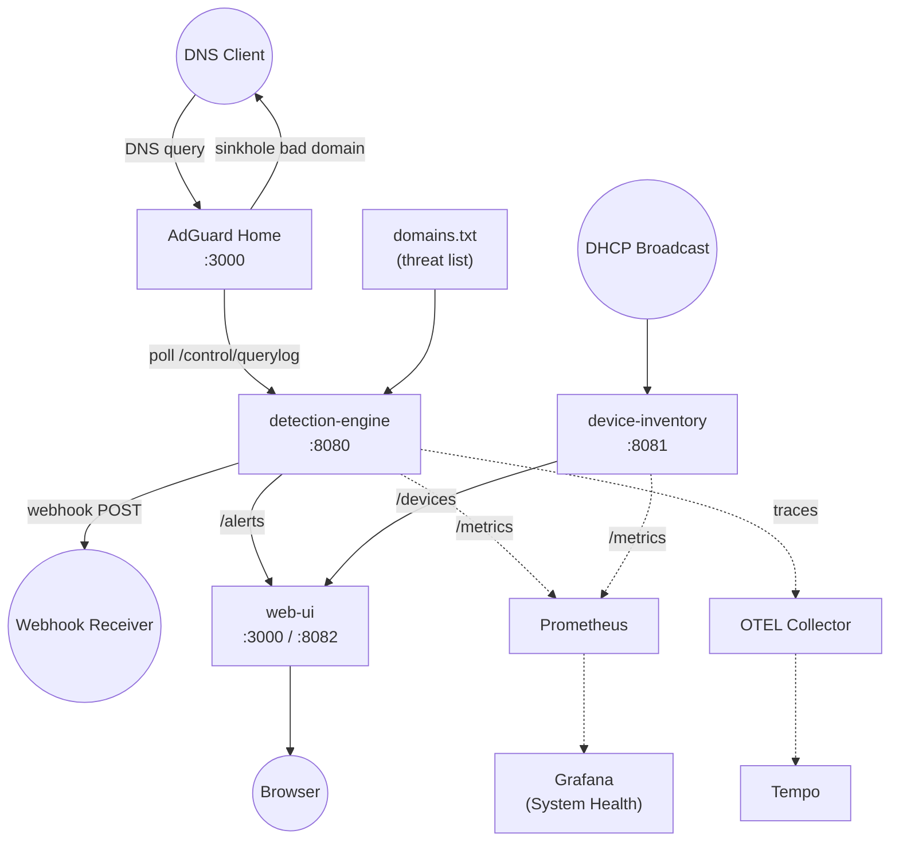

# Getting started — vertical slice

Quick-start guide for running the netSoldier vertical slice: DNS threat
detection, device inventory, webhook alerts, and web dashboard.

**Prerequisite:** complete the [developer setup](dev-setup.md) first (Go, Node.js, Task).

## Architecture



**Data flow:** DNS clients query AdGuard Home, which resolves or sinkhole-blocks
domains on the threat list. The detection engine polls AdGuard's querylog every
30 s, matches against `domains.txt`, and fires alerts via webhook and the
`/alerts` API. Device inventory listens for DHCP broadcasts and exposes
discovered devices on `/devices`. The web UI proxies both APIs into a single
dashboard.

## Running locally

Start each service in a separate terminal. All services log structured JSON to
stdout.

### 1. AdGuard Home (or mock)

If you have a local AdGuard instance:

```bash
# Point detection-engine to it:
export ADGUARD_URL=http://localhost:3000
export ADGUARD_USER=admin
export ADGUARD_PASSWORD=changeme
```

For development without AdGuard, the e2e test (`task test:e2e`) starts a mock
AdGuard automatically.

### 2. detection-engine

```bash
cd apps/detection-engine
LISTEN_ADDR=:8080 \
ADGUARD_URL=http://localhost:3000 \
ADGUARD_USER=admin \
ADGUARD_PASSWORD=changeme \
THREATLIST_PATH=../../detections/ioc/domains.txt \
POLL_INTERVAL=10s \
go run ./cmd/detection-engine
```

Verify: `curl -s localhost:8080/healthz | jq .`

Optional webhook (receives alerts on threat matches):

```bash
export WEBHOOK_URL=https://your-endpoint.example.com/webhook
export WEBHOOK_SECRET=your-secret    # sent as X-Webhook-Secret header
```

### 3. device-inventory

Requires root for the DHCP listener (binds UDP :67). Without root, the HTTP API
still starts — only the DHCP listener fails gracefully.

```bash
cd apps/device-inventory
DB_PATH=/tmp/devices.db \
LISTEN_ADDR=:8081 \
go run ./cmd/device-inventory
```

Verify: `curl -s localhost:8081/devices | jq .`

### 4. web-ui

```bash
cd apps/web-ui
npm install
DEVICE_INVENTORY_URL=http://localhost:8081 \
DETECTION_ENGINE_URL=http://localhost:8080 \
npm run dev
```

Open `http://localhost:5173` — the dashboard shows devices and alerts. The
SvelteKit dev server proxies `/api/devices` and `/api/alerts` to the backends.

## Podman deployment (Pi edge)

The `deploy/podman/` directory contains Podman Quadlet files for systemd-managed
containers. Copy them to the Pi and enable:

```bash
# Copy threat list
sudo mkdir -p /opt/netsoldier/detections/ioc
sudo cp detections/ioc/domains.txt /opt/netsoldier/detections/ioc/

# Install Quadlet files
sudo cp deploy/podman/*.container /etc/containers/systemd/
sudo systemctl daemon-reload
sudo systemctl start adguard device-inventory detection-engine web-ui
```

| Service          | Port  | Notes                                    |
|------------------|-------|------------------------------------------|
| AdGuard Home     | 3000  | DNS on 53, web UI on 3000                |
| detection-engine | 8080  | polls AdGuard at localhost:3000           |
| device-inventory | 8081  | DHCP listener, SQLite at /data/devices.db |
| web-ui           | 8082  | port 8082 to avoid AdGuard conflict       |

All containers use host networking (the Pi is a dedicated appliance).

## Kubernetes deployment (Proxmox SOC)

The Kustomize manifests live in `deploy/kustomize/`. ArgoCD's `netsoldier-appset`
ApplicationSet automatically discovers overlays.

```bash
# Preview what gets applied (proxmox-soc profile)
kubectl kustomize deploy/kustomize/overlays/proxmox-soc/

# Manual apply (ArgoCD handles this in production)
kubectl apply -k deploy/kustomize/overlays/proxmox-soc/
```

Two overlay profiles:

| Profile       | Target         | Key differences                      |
|---------------|----------------|--------------------------------------|
| `proxmox-soc` | Proxmox server | higher resource limits               |
| `pi-edge`     | Raspberry Pi   | arm64 nodeSelector, tight limits     |

Kyverno policies in the `netsoldier` namespace enforce `readOnlyRootFilesystem`,
`runAsNonRoot`, resource limits, and image signature verification.

## Verifying the pipeline

### Automated e2e test

```bash
task test:e2e
```

Builds both Go services, starts mock AdGuard + webhook receiver, and asserts the
full path: bad domain in querylog → alert generated → webhook fires → `/alerts`
API returns the entry.

### Manual verification

1. Configure a device to use AdGuard as its DNS resolver.
2. Query a domain from the threat list:
   ```bash
   dig evil.example.com @<adguard-ip>
   ```
3. Wait for the detection-engine poll interval (default 30 s).
4. Check the alert appeared:
   ```bash
   curl -s <detection-engine>:8080/alerts | jq '.[-1]'
   ```
5. If a webhook is configured, verify delivery in the receiver logs.
6. Open the web UI — the alert should appear on the dashboard and the alerts
   page.

## Configuration reference

### detection-engine

| Variable                       | Default                                    | Description                    |
|--------------------------------|--------------------------------------------|--------------------------------|
| `LISTEN_ADDR`                  | `:8080`                                    | HTTP listen address            |
| `ADGUARD_URL`                  | `http://adguard-web.dns.svc:3000`          | AdGuard Home base URL          |
| `ADGUARD_USER`                 | `admin`                                    | AdGuard BasicAuth user         |
| `ADGUARD_PASSWORD`             | `changeme`                                 | AdGuard BasicAuth password     |
| `THREATLIST_PATH`              | `/etc/detection-engine/domains.txt`        | Domain threat list file        |
| `POLL_INTERVAL`                | `30s`                                      | AdGuard querylog poll interval |
| `WEBHOOK_URL`                  | *(empty — disabled)*                       | Webhook endpoint (opt-in)      |
| `WEBHOOK_SECRET`               | *(empty)*                                  | X-Webhook-Secret header value  |
| `OTEL_EXPORTER_OTLP_ENDPOINT`  | `otel-collector.observability.svc:4317`    | OTLP gRPC endpoint for traces  |

### device-inventory

| Variable      | Default              | Description                          |
|---------------|----------------------|--------------------------------------|
| `LISTEN_ADDR` | `:8081`              | HTTP listen address                  |
| `DB_PATH`     | `/data/devices.db`   | SQLite database path                 |

### web-ui

| Variable               | Default                          | Description                     |
|------------------------|----------------------------------|---------------------------------|
| `PORT`                 | `3000`                           | HTTP listen port                |
| `DEVICE_INVENTORY_URL` | `http://device-inventory:8081`   | device-inventory backend URL    |
| `DETECTION_ENGINE_URL` | `http://detection-engine:8080`   | detection-engine backend URL    |

## Observability

### Metrics

Both Go services expose Prometheus metrics on `/metrics` (same port as the API).
ServiceMonitors in the Kustomize base enable automatic scraping.

| Metric                                         | Type    | Service          |
|------------------------------------------------|---------|------------------|
| `detection_engine_queries_checked_total`        | counter | detection-engine |
| `detection_engine_alerts_generated_total`       | counter | detection-engine |
| `detection_engine_threatlist_domains_total`     | gauge   | detection-engine |
| `detection_engine_poll_errors_total`            | counter | detection-engine |
| `detection_engine_webhook_deliveries_total`     | counter | detection-engine |
| `device_inventory_dhcp_packets_total`           | counter | device-inventory |

### Grafana dashboard

The **"netSoldier — System Health"** dashboard is provisioned automatically via
ConfigMap sidecar. It includes:

- **Service Status** — up/down stat panels for each service
- **Detection Pipeline** — queries checked rate, alerts generated rate
- **Reliability** — AdGuard poll errors, webhook delivery results
- **Infrastructure** — DHCP packet rate, goroutines, RSS memory

### Prometheus alerts

| Alert                      | Severity | Fires when                                 |
|----------------------------|----------|---------------------------------------------|
| `NetSoldierServiceDown`    | critical | any service target unreachable for > 2 min  |
| `DetectionEnginePollErrors`| warning  | sustained AdGuard poll errors for > 5 min   |
| `WebhookDeliveryFailures`  | warning  | sustained webhook failures for > 5 min      |
| `WebhookQueueDrops`        | warning  | webhook queue full, dropping alerts > 1 min |
